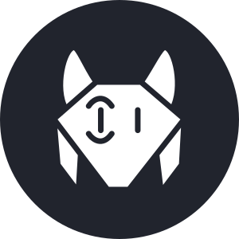

  
  <h1 align="center">Lynx</h1>
  

     <a href="https://lynxweb.vercel.app">Demo</a> 
     
    Open source links & bookmarks sharing, managing and discovering platform
  

## Tech Stack
- **Database**: PostgresSQL & Prisma as a ORM
- **Frontend**: Next.js
- **Backend**: Node.js + Hyper-Express

## Features

- Dark mode from the start
- Link sharing, discovery, managing, observing link groups or users
- Clean, modern design
- Fast, and ready as PWA

## Authors
  [@net-runner](https://www.github.com/net-runner) & [@przemec](https://www.github.com/przemec) 
